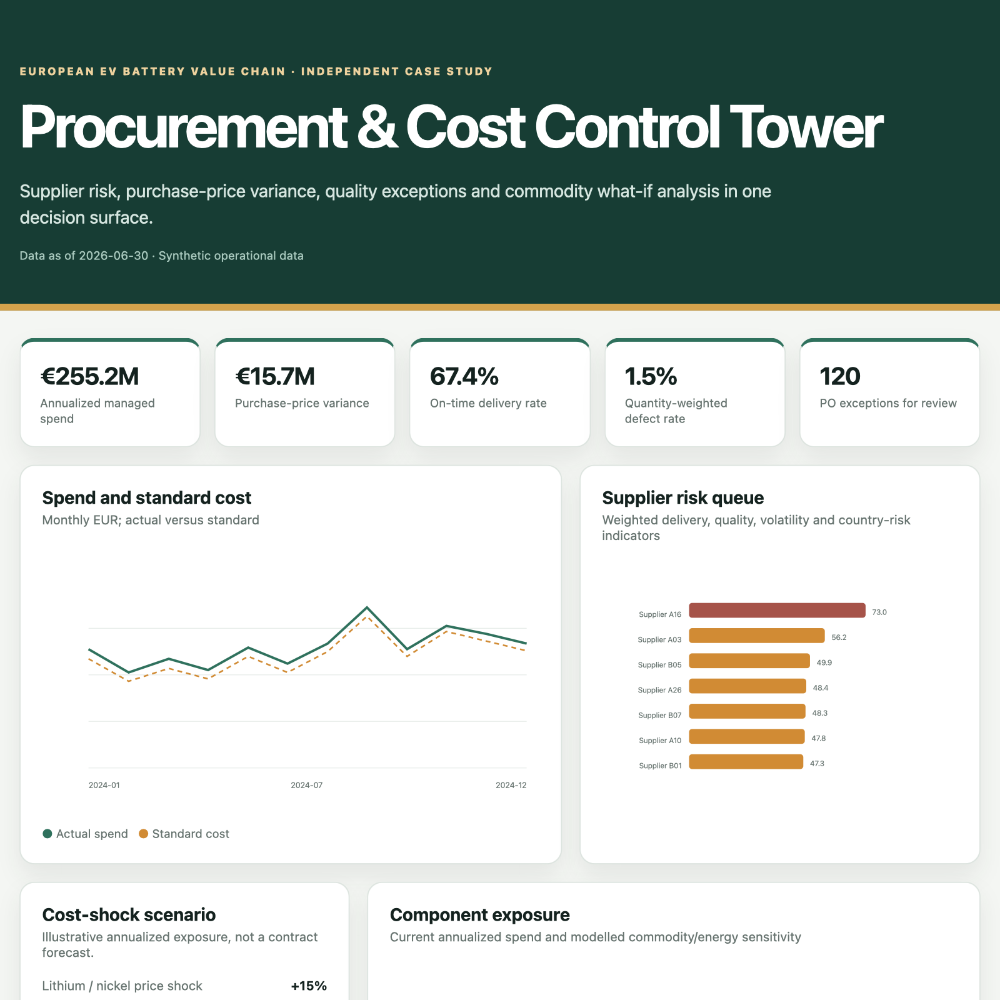

# EV Procurement & Cost Control Tower

An independent portfolio project showing how data governance, ETL, anomaly detection and management BI can support a European electric-vehicle battery supply chain.

> All supplier, purchase-order, quality and delivery records in the runnable demo are synthetic. Public sources are used only to frame commodity, energy and critical-material risks. No BMW Group or supplier internal data are used.



## Decisions supported

- Which suppliers combine cost, delivery and quality risk?
- Which components drive purchase-price variance?
- Where are unusual order prices or defect rates emerging?
- How does a lithium or industrial-electricity shock change annualized spend?
- Which records need a buyer or quality-engineering review?

## Product capabilities

- Reproducible generation of supplier, component and purchase-order tables
- Explicit data contract and SQLite analytical mart
- Grain, uniqueness, null, join-coverage and reconciliation checks
- Supplier scorecard with documented risk weights
- Explainable robust multivariate anomaly detection with reason codes
- Commodity and energy what-if analysis
- Interactive management dashboard
- Unit tests and GitHub Actions

## Quick start

```bash
python -m venv .venv
source .venv/bin/activate
pip install -r requirements.txt
python src/generate_data.py
python src/pipeline.py
python -m unittest discover -s tests -p "test_*.py"
python -m http.server 8000
```

Open `http://localhost:8000/dashboard/`.

## Architecture

```text
supplier master ─┐
component/BOM ───┼──> contract checks ──> SQLite marts ──> KPI model
purchase orders ─┘                              │
                                               ├─ supplier risk score
                                               ├─ price/quality anomalies
                                               └─ cost-shock scenarios
                                                         │
                                                         ▼
                                                 control-tower UI
```

## Metric definitions

- **Purchase-price variance (PPV):** actual spend minus standard-cost spend for the same ordered quantity.
- **On-time rate:** share of purchase orders with `delivery_delay_days <= 2`.
- **Defect rate:** quantity-weighted defective parts divided by received quantity.
- **Supplier risk score:** normalized weighted combination of late-delivery rate (35%), defect rate (35%), price volatility (20%) and country risk (10%).
- **Anomaly:** record in the top 2.5% of a robust multivariate score built from price variance, delivery delay and defect rate. The model prioritizes review; it does not prove wrongdoing.

## Public context

- [World Bank Commodity Price Data (Pink Sheet)](https://www.worldbank.org/en/research/commodity-markets)
- [European Commission Critical Raw Materials Act](https://commission.europa.eu/topics/competitiveness/green-deal-industrial-plan/european-critical-raw-materials-act_en)
- [EU Raw Materials Information System: battery value chain](https://rmis.jrc.ec.europa.eu/bvc)
- [Eurostat industrial electricity prices](https://data.europa.eu/data/datasets/xxs4nqkasm5cmhhcuozwa?locale=en)

## Honest limitations

- Synthetic supplier behavior cannot validate real-world thresholds.
- Country risk is a portfolio modelling input, not an assessment of any real company.
- Commodity-price exposure is simplified and does not represent a negotiated contract formula.
- Decisions require buyer, finance, engineering and supplier-quality review.

## License

MIT for code. Public data users must check the relevant source terms.
# ev-procurement-cost-control
Synthetic EV battery supply-chain control tower for spend, supplier risk, data quality and cost-shock scenarios.
